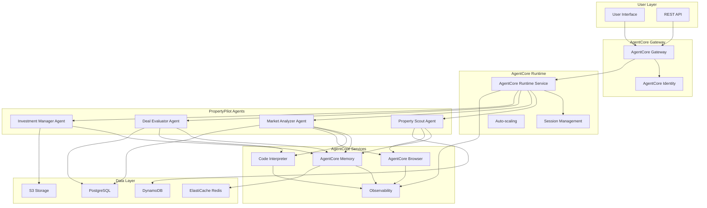

# AgentCore Integration Design Document

## Overview

This design document outlines the integration of Amazon Bedrock AgentCore services into the PropertyPilot multi-agent real estate investment system. The integration will transform PropertyPilot from a basic Strands Agents deployment to an enterprise-grade, scalable, and observable multi-agent platform leveraging AgentCore Runtime, Memory, Observability, Code Interpreter, and Browser services.

The design maintains backward compatibility with the existing PropertyPilot system while adding enterprise capabilities including session isolation, persistent memory, comprehensive observability, secure code execution, and automated web interaction.

## Architecture

### High-Level Architecture



### Component Integration Strategy

The integration follows a layered approach where AgentCore services enhance existing PropertyPilot capabilities without breaking current functionality:

1. **Runtime Layer**: AgentCore Runtime hosts all PropertyPilot agents with session isolation
2. **Memory Layer**: AgentCore Memory provides persistent context across sessions
3. **Tools Layer**: Code Interpreter and Browser enhance agent capabilities
4. **Observability Layer**: Comprehensive monitoring and tracing
5. **Security Layer**: Identity management and secure access control

## Components and Interfaces

### 1. AgentCore Runtime Integration

**Purpose**: Replace current deployment with enterprise-grade serverless runtime

**Key Components**:
- Session-isolated agent execution
- Auto-scaling based on demand
- Multi-modal payload support
- Fast cold start optimization

**Interface Design**:
```python
class AgentCoreRuntimeManager:
    def deploy_agent(self, agent_config: AgentConfig) -> AgentDeployment
    def invoke_agent(self, agent_arn: str, payload: Dict, session_id: str) -> AgentResponse
    def manage_sessions(self, session_config: SessionConfig) -> SessionManager
    def configure_scaling(self, scaling_config: ScalingConfig) -> ScalingManager
```

**Configuration**:
- Memory allocation: 2048-4096 MB per agent
- Timeout: 900 seconds for complex analyses
- Concurrent executions: 100-200 based on demand
- Session persistence: 30 minutes timeout

### 2. AgentCore Memory Integration

**Purpose**: Provide persistent memory for cross-session context awareness

**Memory Strategy**:
- **Short-term Memory**: Conversation context within sessions
- **Long-term Memory**: Property data, market insights, user preferences
- **Shared Memory**: Cross-agent data sharing for collaborative analysis

**Memory Organization**:
```python
class PropertyPilotMemory:
    # Short-term memory for active sessions
    conversation_memory: Dict[str, ConversationContext]
    
    # Long-term memory for persistent data
    property_database: Dict[str, PropertyRecord]
    market_insights: Dict[str, MarketAnalysis]
    user_preferences: Dict[str, UserProfile]
    
    # Cross-agent shared memory
    analysis_cache: Dict[str, AnalysisResult]
    workflow_state: Dict[str, WorkflowContext]
```

**Memory Access Patterns**:
- Property Scout: Store discovered properties, retrieve search history
- Market Analyzer: Cache market research, access demographic data
- Deal Evaluator: Store financial calculations, retrieve comparable analyses
- Investment Manager: Access all agent outputs, maintain portfolio context

### 3. AgentCore Code Interpreter Integration

**Purpose**: Enable secure code execution for financial calculations and data analysis

**Use Cases**:
- Complex ROI calculations with multiple scenarios
- Statistical analysis of market trends
- Data visualization for property comparisons
- Financial modeling and projections

**Integration Points**:
```python
class CodeInterpreterIntegration:
    def execute_financial_analysis(self, property_data: Dict, market_data: Dict) -> AnalysisResult
    def generate_visualizations(self, data: DataFrame) -> List[Chart]
    def run_statistical_models(self, historical_data: List[Dict]) -> ModelResults
    def calculate_investment_scenarios(self, scenarios: List[Scenario]) -> ScenarioResults
```

**Security Configuration**:
- Isolated execution environments per session
- No cross-session data access
- Secure file handling for temporary calculations
- Resource limits to prevent abuse

### 4. AgentCore Browser Integration

**Purpose**: Automate web interactions for real-time data collection

**Web Automation Capabilities**:
- Property listing scraping from Zillow, Realtor.com
- Market data collection from real estate websites
- Demographic data gathering from government sources
- News and trend analysis from real estate publications

**Browser Management**:
```python
class BrowserIntegration:
    def scrape_property_listings(self, search_criteria: SearchCriteria) -> List[Property]
    def collect_market_data(self, location: str) -> MarketData
    def gather_demographic_info(self, area: str) -> Demographics
    def monitor_price_changes(self, property_ids: List[str]) -> PriceUpdates
```

**Scaling and Security**:
- Auto-scaling browser instances based on demand
- Enterprise-grade security for web interactions
- Session replay for debugging and audit
- Rate limiting to respect website policies

### 5. AgentCore Observability Integration

**Purpose**: Comprehensive monitoring, tracing, and debugging capabilities

**Observability Components**:
- Real-time performance metrics
- Distributed tracing across agents
- Error tracking and alerting
- Usage analytics and optimization insights

**Metrics Collection**:
```python
class ObservabilityManager:
    # Performance metrics
    def track_agent_performance(self, agent_id: str, metrics: PerformanceMetrics)
    def monitor_session_duration(self, session_id: str, duration: float)
    def record_token_usage(self, agent_id: str, tokens: int)
    
    # Business metrics
    def track_property_analyses(self, count: int, success_rate: float)
    def monitor_user_engagement(self, session_metrics: SessionMetrics)
    def measure_analysis_accuracy(self, predictions: List[Prediction], outcomes: List[Outcome])
```

**Dashboard Configuration**:
- CloudWatch integration for AWS-native monitoring
- Custom dashboards for PropertyPilot-specific metrics
- Alerting for performance degradation and errors
- Cost optimization insights

## Data Models

### Enhanced Property Model
```python
@dataclass
class EnhancedProperty:
    # Core property data
    property_id: str
    address: str
    price: float
    property_type: str
    bedrooms: int
    bathrooms: int
    square_feet: int
    
    # AgentCore enhancements
    session_context: SessionContext
    memory_references: List[MemoryReference]
    analysis_history: List[AnalysisRecord]
    web_research_data: WebResearchData
    
    # Observability metadata
    created_by_agent: str
    processing_time: float
    confidence_score: float
```

### Session Context Model
```python
@dataclass
class SessionContext:
    session_id: str
    user_id: Optional[str]
    created_at: datetime
    last_activity: datetime
    
    # User preferences and context
    search_criteria: SearchCriteria
    investment_preferences: InvestmentPreferences
    analysis_history: List[str]
    
    # Agent interaction state
    active_workflows: List[WorkflowState]
    cached_results: Dict[str, Any]
    memory_snapshots: List[MemorySnapshot]
```

### Memory Record Model
```python
@dataclass
class MemoryRecord:
    record_id: str
    record_type: MemoryType  # SHORT_TERM, LONG_TERM, SHARED
    content: Dict[str, Any]
    
    # AgentCore metadata
    created_by: str
    session_id: Optional[str]
    expiry_time: Optional[datetime]
    
    # Access control
    access_permissions: List[str]
    sharing_scope: SharingScope
```

## Error Handling

### Error Categories and Strategies

**1. AgentCore Service Errors**
- Runtime deployment failures
- Memory service unavailability
- Code Interpreter execution errors
- Browser automation failures

**Error Handling Strategy**:
```python
class AgentCoreErrorHandler:
    def handle_runtime_error(self, error: RuntimeError) -> FallbackResponse
    def handle_memory_error(self, error: MemoryError) -> CachedResponse
    def handle_code_interpreter_error(self, error: CodeInterpreterError) -> ManualCalculation
    def handle_browser_error(self, error: BrowserError) -> StaticDataResponse
```

**2. Migration and Compatibility Errors**
- Legacy system integration issues
- Data format incompatibilities
- Configuration conflicts

**3. Performance and Scaling Errors**
- Resource exhaustion
- Timeout errors
- Concurrent execution limits

**Error Recovery Mechanisms**:
- Graceful degradation to basic functionality
- Automatic retry with exponential backoff
- Circuit breaker pattern for external services
- Comprehensive error logging and alerting

## Testing Strategy

### 1. Unit Testing
**Scope**: Individual AgentCore service integrations
**Tools**: pytest, moto for AWS mocking
**Coverage**: 90%+ for critical integration points

**Test Categories**:
- AgentCore Runtime deployment and invocation
- Memory service read/write operations
- Code Interpreter execution scenarios
- Browser automation workflows
- Observability data collection

### 2. Integration Testing
**Scope**: End-to-end workflows with AgentCore services
**Environment**: Dedicated AgentCore test environment

**Test Scenarios**:
- Complete property analysis workflow with session persistence
- Multi-agent collaboration with shared memory
- Error handling and recovery scenarios
- Performance under load conditions

### 3. Performance Testing
**Scope**: Scalability and performance validation
**Tools**: Locust, AWS Load Testing Solution

**Performance Targets**:
- Agent cold start: < 2 seconds
- Session creation: < 500ms
- Memory operations: < 100ms
- Code execution: < 30 seconds for complex calculations
- Browser automation: < 60 seconds per page

### 4. Security Testing
**Scope**: Security validation of AgentCore integration
**Focus Areas**:
- Session isolation verification
- Memory access control validation
- Code Interpreter sandbox security
- Browser automation security

### 5. Migration Testing
**Scope**: Backward compatibility and migration validation
**Scenarios**:
- Existing PropertyPilot functionality preservation
- Data migration from current system
- Gradual rollout scenarios
- Rollback procedures

## Implementation Phases

### Phase 1: Foundation (Weeks 1-2)
- AgentCore Runtime setup and basic agent deployment
- Session management implementation
- Basic observability integration
- Unit test development

### Phase 2: Memory Integration (Weeks 3-4)
- AgentCore Memory service integration
- Memory strategy implementation
- Cross-agent memory sharing
- Memory-related testing

### Phase 3: Enhanced Capabilities (Weeks 5-6)
- Code Interpreter integration for financial calculations
- Browser automation for web data collection
- Advanced observability and monitoring
- Performance optimization

### Phase 4: Production Readiness (Weeks 7-8)
- Security hardening and validation
- Comprehensive testing and validation
- Documentation and training materials
- Migration planning and execution

### Phase 5: Optimization and Monitoring (Weeks 9-10)
- Performance tuning based on real usage
- Advanced observability dashboard setup
- Cost optimization
- User feedback integration and improvements